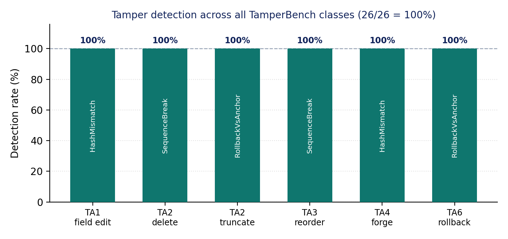
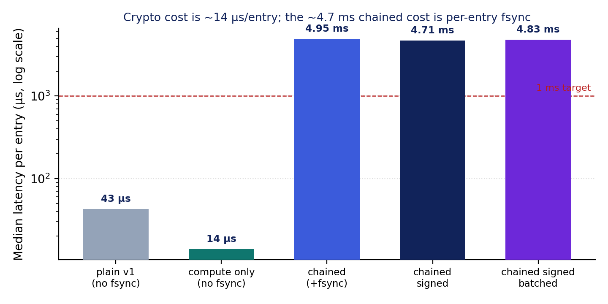
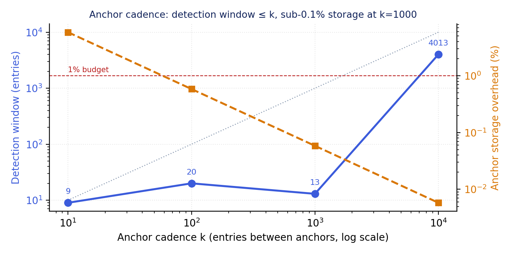
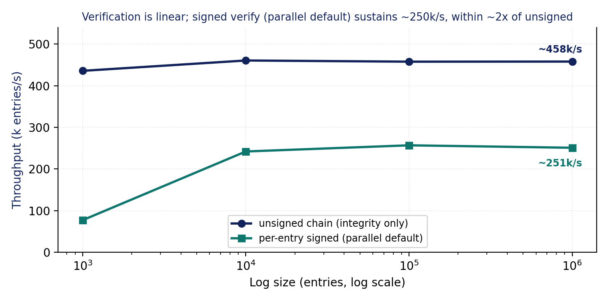
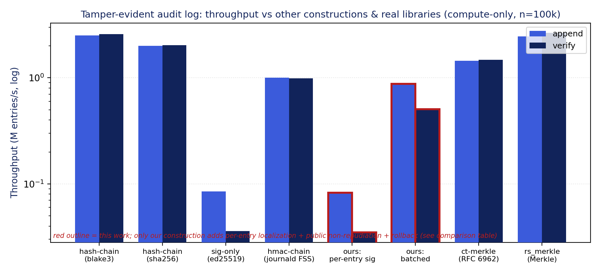

<div align="center">


### A blake3-chained, ed25519-signed, externally anchored audit ledger for clinical AI agents


[](https://huggingface.co/datasets/Quome/tamperbench)

[**Quickstart**](#quickstart) · [How it works](#how-it-works) · [Reproduce](#reproduce-the-experiments) · [Results](#headline-results) · [Paper](papers/003-tamper-audit/main.pdf) · [Dataset](https://huggingface.co/datasets/Quome/tamperbench) · [Cite](#cite)

</div>

---

An adversarial agent, a compromised host process, or a privileged operator can silently rewrite, drop, reorder, or roll back a clinical agent's action log, defeating the traceability HAARF C2 requires. This layer replaces the gateway's plain JSONL audit file and the in-memory provenance chain with one append-only record: every entry is blake3-chained to its predecessor, ed25519-signed, fsync'd before the call returns, and periodically Merkle-anchored to an external sink, with a streaming verifier (qfire audit verify) that names the first tampered entry and exits 2. On TamperBench the verifier detects 100% of tampered logs (26/26) and localizes 100% of point tampers (20/20); the cryptography costs 14.0 microseconds per entry (~71,400 entries/s/core), so the observed ~4.7 ms chained write latency on a laptop is the per-entry fsync durability tax, and verification runs at ~458,000 entries/s unsigned and ~251,000 entries/s signed.

<div align="center">

[](https://youtu.be/MX4HrLufa3I)

**▶ Watch: [TamperBench: Tamper-Evident AI Logs (talk)](https://youtu.be/MX4HrLufa3I)**

</div>

`quledger` is **a module of the QUOKKAGUARD program**: one Rust security gateway (`qfire`) that sits in front of any OpenAI-compatible model endpoint and decides **ALLOW ▸ forward · BLOCK ▸ refuse · ESCALATE ▸ human review** for every request and response. Each module adds exactly one enforcement layer to that gateway plus one adversarial dataset and one paper. This repository is a self-contained snapshot of the gateway with **this layer** (`src/audit/`, on the *all* path, HAARF control C2 (primary); C8.1.5, C8.4.3 secondary), its dataset (**TamperBench**), the experiment harness, and the paper.

> Everything here runs **offline**: no model API keys, no network calls in the experiments.

## How it works

- **Chained line format** — every entry is one JSON line `{seq, ts, kind, body, prev_hash, this_hash, sig}` where `this_hash = blake3(line bytes from '{' through the prev_hash closing quote)` and the first entry's `prev_hash` is `GENESIS`; `kind` is header, decision, mutation, checkpoint, or admission, so the gateway decision stream, the harness mutation ledger, and the qubom AIBOM stamp share one chain.
- **ed25519 per-entry signatures** — `sig = ed25519(this_hash)` under a key loaded from `audit.key` (or `QFIRE_AUDIT_KEY`; released via attestation in the enclave). Modes `plain | chained | chained_signed | chained_signed_batched`: batched signs Merkle checkpoints instead of every entry (33 B/entry vs 96 B) while keeping per-entry localization.
- **External Merkle anchors** — every `anchor_every` = k entries the incremental Merkle root is published to an anchor sink (a separate anchors JSONL); `qfire audit verify --anchors` then catches truncation and host-level rollback (TA6) that a self-contained chain cannot see. k = 1000 gives a 13-entry detection window at 0.058% storage overhead.
- **Single-writer, fail-closed write path** — appends are serialized and fsync'd before returning (`fail_open = false`), so an action is on stable storage before the agent proceeds; the chain+sign computation itself is 14.0 microseconds per entry.
- **Localizing streaming verifier** — walks the log in one pass checking hashes, sequence numbers, signatures (parallel + batched ed25519, 23x faster than sequential with identical guarantees), and anchors, and reports `ok`, `first_bad_seq`, and a diagnosis class (HashMismatch, SequenceBreak, RollbackVsAnchor); `qfire audit prove --seq N` emits a Merkle inclusion proof for third-party auditors.

## Quickstart

Requires Rust 1.85+ (`rustup`), Python 3.10+ for the analysis scripts, and `tectonic` (or `pdflatex`) only if you want to rebuild the paper.

```bash
git clone https://github.com/quome-cloud/quledger
cd quledger
cargo build --release
cargo test --lib audit:: && cargo test --test audit_tamper   # this layer's tests
```

Then see the layer in action:

```bash
# 1. Export a clean signed + anchored fixture log (1000 entries, anchor every 100)
#    -> datasets/003-tamper-audit/fixture/{audit.jsonl, anchors.jsonl, key}
cargo test --release --test audit_tamper -- --ignored --exact export_fixture

# 2. Verify the chain, signatures and anchors -> JSON report with "ok": true, exit 0
./target/release/qfire audit verify --log datasets/003-tamper-audit/fixture/audit.jsonl \
  --anchors datasets/003-tamper-audit/fixture/anchors.jsonl

# 3. Chain head + last anchor, and a Merkle inclusion proof for entry 42 ("verified": true)
./target/release/qfire audit head --log datasets/003-tamper-audit/fixture/audit.jsonl \
  --anchors datasets/003-tamper-audit/fixture/anchors.jsonl
./target/release/qfire audit prove --log datasets/003-tamper-audit/fixture/audit.jsonl --seq 42

# 4. Apply the TamperBench mutations and re-verify one -> "ok": false, first_bad_seq + class, exit 2
python3 scripts/003-tamper-audit/tamper.py --log datasets/003-tamper-audit/fixture/audit.jsonl \
  --anchors datasets/003-tamper-audit/fixture/anchors.jsonl \
  --out datasets/003-tamper-audit/tampered --per-class 1
./target/release/qfire audit verify --log datasets/003-tamper-audit/tampered/ta1_field_edit-0.jsonl \
  --anchors datasets/003-tamper-audit/fixture/anchors.jsonl; echo "exit=$?"   # exit=2
```

## Reproduce the experiments

Every number in the paper traces to one of these runs (95% Wilson CIs, deterministic seeds, pinned model snapshots). Run outputs land in `results/003-tamper-audit/` (not tracked; see [`results/003-tamper-audit/README.md`](results/003-tamper-audit/README.md) for the exact regeneration commands).

| Exp | What it measures | Needs |
|---|---|---|
| E1/E5 | Detection completeness and localization over every TamperBench class via the real CLI verifier | offline |
| E2 | Per-entry write cost by mode (plain, chained, chained_signed, compute-only) with and without fsync | offline |
| E3 | Anchor cadence sweep: rollback detection window vs storage overhead over a 20,000-entry log | offline |
| E4 | Verification throughput vs log size (1e3 to 1e6 entries), unsigned and per-entry-signed | offline |
| E6/E7 | Head-to-head vs hash-chain, HMAC-chain, signature-only, ct-merkle and rs_merkle constructions, plus the parallel+batch signature-verification speedup | offline |
| figs | Regenerate the paper figures from the result artifacts and build the PDF | offline |

```bash
# E1/E5 — Detection completeness and localization over every TamperBench class via the real CLI verifier
cargo build --release && python3 scripts/003-tamper-audit/e1_detection.py   # -> results/003-tamper-audit/e1_detection/summary.json; authoritative proof: cargo test --test audit_tamper

# E2 — Per-entry write cost by mode (plain, chained, chained_signed, compute-only) with and without fsync
cargo bench --bench audit_write

# E3 — Anchor cadence sweep: rollback detection window vs storage overhead over a 20,000-entry log
mkdir -p results/003-tamper-audit/e3_anchor && python3 scripts/003-tamper-audit/e3_anchor_sweep.py > results/003-tamper-audit/e3_anchor/e3_anchor_sweep.csv

# E4 — Verification throughput vs log size (1e3 to 1e6 entries), unsigned and per-entry-signed
cargo bench --bench audit_verify

# E6/E7 — Head-to-head vs hash-chain, HMAC-chain, signature-only, ct-merkle and rs_merkle constructions, plus the parallel+batch signature-verification speedup
cargo run --release --example audit_compare -- 100000

# figs — Regenerate the paper figures from the result artifacts and build the PDF
python3 scripts/003-tamper-audit/make_figs.py && cd papers/003-tamper-audit && make paper
```

**Dataset — TamperBench** (`datasets/003-tamper-audit/`): Deterministic (seed 42), fully synthetic clinical action streams plus mutated chained audit logs spanning six audit-tampering classes (TA1 field edit, TA2 delete and truncate, TA3 reorder, TA4 forge, TA6 rollback) with labels.json ground truth; the E1 corpus is 26 tampered logs derived from a 200-entry signed and anchored fixture.

Regenerate the corpus (deterministic seeds):

```bash
cargo build --release && cargo test --release --test audit_tamper -- --ignored --exact export_fixture && python3 scripts/003-tamper-audit/tamper.py --log datasets/003-tamper-audit/fixture/audit.jsonl --anchors datasets/003-tamper-audit/fixture/anchors.jsonl --out datasets/003-tamper-audit/tampered --per-class 5 --seed 42 && python3 scripts/003-tamper-audit/gen.py --out datasets/003-tamper-audit/streams --streams 10 --events 1000 --seed 42
```

The corpus is also published as a Hugging Face dataset with a full data card: **[Quome/tamperbench](https://huggingface.co/datasets/Quome/tamperbench)** (`datasets.load_dataset("Quome/tamperbench")`, or `hf download Quome/tamperbench --repo-type dataset`).

All data are synthetic; no protected health information is used anywhere in this repository.

## Results at a glance

Figures are reproduced from the paper; every number regenerates from the commands in [Reproduce the experiments](#reproduce-the-experiments).

<p align="center"></p>

*The paper in one figure (E1/E5): across all six TamperBench attack classes the streaming verifier detects 100% of tampered logs, and each bar is annotated with the verifier's diagnosis — in-place edits and forgeries break the blake3 hash, deletion and reordering break the sequence, rollback is caught against the external anchor.*

<p align="center"></p>

*E2: per-entry write cost by mode (log scale). Cryptography is ~14 µs per entry; the ~4.7 ms chained cost is the per-entry fsync that guarantees fail-closed durability. Signing adds no measurable cost over chaining.*

<p align="center"></p>

*E3: anchor cadence sweep. The rollback-detection window stays under the k bound at every cadence while storage overhead drops below 1% from k=100 and reaches 0.058% at k=1000.*

<p align="center"></p>

*E4: verification throughput is flat across three decades of log size for both the unsigned chain (~458k entries/s) and per-entry-signed verification with the parallel+batch default (~251k entries/s).*

<p align="center"></p>

*E6/E7: throughput against hash-chain, HMAC-chain, signature-only and Merkle-library constructions (compute-only, n=100k). Per-entry signing is ed25519-bound; the batched mode recovers most of that throughput while keeping the chain.*

## Headline results

| Metric | Value | Context |
|---|---|---|
| Tamper detection rate (E1) | **100% (26/26 tampered logs)** | every TA1-TA6 class; diagnosis matches the attacked mechanism |
| Tamper localization (E5) | **100% (20/20)** | exact first-broken seq on the point-tamper classes |
| Chain + sign compute cost (E2) | **14.0 microseconds/entry (~71,400 entries/s/core)** | no disk write; signing adds no measurable cost over chaining |
| Chained signed write latency with fsync (E2) | **4.71 ms/entry on the dev laptop; 64-214 microseconds projected on NVMe** | the fail-closed durability tax, not cryptography |
| Anchor cadence sweet spot (E3) | **k = 1000: 13-entry rollback window at 0.058% storage overhead** | 20,000-entry log; every cadence detects the rollback |
| Verification throughput (E4/E7) | **~458,000 entries/s unsigned; ~251,000 entries/s per-entry-signed (23x over sequential)** | flat from 1e3 to 1e6 entries; 2.18 s for 1e6 unsigned |

Full methodology, ablations, and statistics: **[the paper](papers/003-tamper-audit/main.pdf)**.

## The paper

**Tamper-Evident Action Provenance for Confidential Clinical AI Agents**

- PDF: [`papers/003-tamper-audit/main.pdf`](papers/003-tamper-audit/main.pdf)
- Source: [`papers/003-tamper-audit/`](papers/003-tamper-audit/) — `main.tex`, `numbers.tex` (every headline macro, generated by the scripts above), `figs/`, `refs.bib`
- Pre-registered proposal (threat model, hypotheses, experiment→figure map): [`papers/003-tamper-audit/PROPOSAL.md`](papers/003-tamper-audit/PROPOSAL.md)
- Rebuild: `cd papers/003-tamper-audit && make paper` (tectonic, or pdflatex + bibtex)

## Repository layout

| Path | What |
|---|---|
| `src/` | The `qfire` gateway crate. This paper's layer lives in `src/audit/`; the other modules are the always-on baseline it plugs into. |
| `src/bin/` | CLI (`qfire`) and per-paper experiment harnesses |
| `rules/`, `chains/` | Declarative rule and detector-chain library used by the gateway |
| `datasets/003-tamper-audit/` | TamperBench (also on Hugging Face: [Quome/tamperbench](https://huggingface.co/datasets/Quome/tamperbench)) |
| `scripts/003-tamper-audit/` | Dataset generator, experiment runners, figure and `numbers.tex` builders |
| `scripts/common/` | Shared helpers |
| `papers/003-tamper-audit/` | The paper (LaTeX + PDF + proposal) |
| `results/003-tamper-audit/` | Experiment outputs (see above) |
| `tests/`, `benches/` | Integration tests and Criterion benches |
| `SNAPSHOT.md` | Which `quokkaguard` commit this repo was exported from |

## Relationship to QUOKKAGUARD

This repo is a **snapshot** of the QUOKKAGUARD program's gateway (export `1c04c3a34841`, 2026-10-02), filtered to the `quledger` module. The full `qfire` crate is included so this layer builds, tests, and runs standalone; the other modules are the always-on baseline the layer plugs into. Issues and pull requests are welcome here.

This layer builds on: [QFIRE (medRxiv)](https://www.medrxiv.org/content/10.64898/2026.06.04.26354950v1), [quanchor](https://github.com/quome-cloud/quanchor).

Sibling repos in the series: [quanchor](https://github.com/quome-cloud/quanchor), [qubom](https://github.com/quome-cloud/qubom), [quwarden](https://github.com/quome-cloud/quwarden), [qudam](https://github.com/quome-cloud/qudam), [quantidote](https://github.com/quome-cloud/quantidote), [quorum](https://github.com/quome-cloud/quorum), [qutriage](https://github.com/quome-cloud/qutriage), [qufair](https://github.com/quome-cloud/qufair), [qudrift](https://github.com/quome-cloud/qudrift), [qupassport](https://github.com/quome-cloud/qupassport), [quconsent](https://github.com/quome-cloud/quconsent), [qubroker](https://github.com/quome-cloud/qubroker), [qusiege](https://github.com/quome-cloud/qusiege).

## Cite

If you use this code or dataset, cite the paper and the HAARF framework it implements:

```bibtex
@unpublished{schwoebel2026quledger,
  author = {Schwoebel, James},
  title  = {Tamper-Evident Action Provenance for Confidential Clinical AI Agents},
  note   = {Preprint. Quome, QUOKKAGUARD program (quledger module)},
  year   = {2026},
  url    = {https://github.com/quome-cloud/quledger}
}

@unpublished{schwoebel2026haarf,
  author = {Schwoebel, Jim and Frasch, Martin and Spalding, Art and Sewell, Ed and Englert, Phil and Halpert, Ben and Overbay, Collin and Semenec, Ingrida and Shor, Joel},
  title  = {{HAARF}: Healthcare {AI} agents regulatory framework --- a comprehensive security verification standard for autonomous {AI} systems in clinical environments},
  note   = {medRxiv Preprint},
  year   = {2026},
  month  = {April},
  doi    = {10.64898/2026.04.09.26350519},
  url    = {https://www.medrxiv.org/content/10.64898/2026.04.09.26350519v1}
}
```

## Status

Research prototype. It demonstrates the layer end to end with reproducible experiments; it is not a certified medical device or a production security product. Threat-model boundaries and known gaps are in the paper's Discussion.

## License

Apache License 2.0 — see [LICENSE](LICENSE). Copyright (c) 2026 Quome, Inc.
